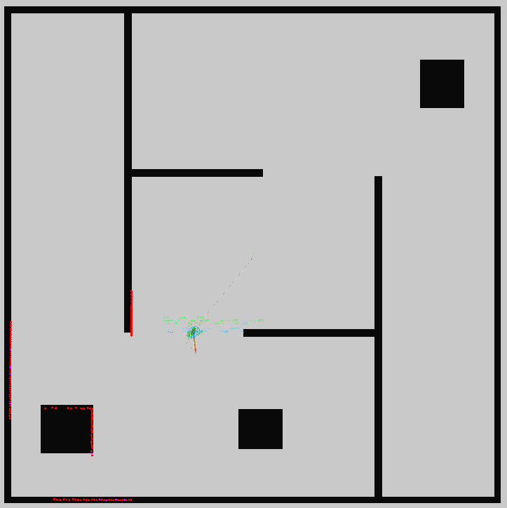
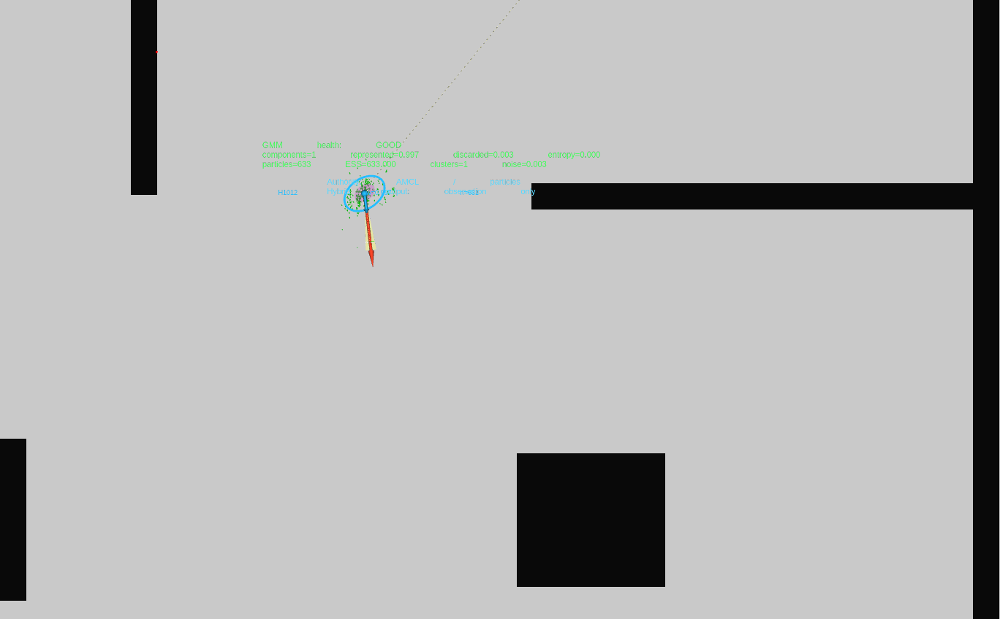

# ROS 2 Hybrid Localization

`ros2_hybrid_localization` is a ROS 2 Jazzy research prototype for adaptive
localization in SE(2). The long-term architecture uses particles for global
initialization, ambiguity, and recovery, then transitions to a bounded Gaussian
mixture when the belief can be represented compactly.

The **current runtime milestone is observation mode**. Nav2 AMCL remains the
localization authority and publishes the particle cloud and `map -> odom`. This
repository consumes that cloud, clusters it, extracts a Gaussian mixture,
computes health/evidence metrics, and visualizes the result in RViz. The hybrid
pipeline does **not** publish an authoritative localization transform yet.

## Engineering overview

The project is structured to keep probabilistic and numerical localization logic
independent from ROS 2 integration. The current implementation includes:

- a ROS-independent C++20 core for SE(2) geometry, weighted particle statistics,
  clustering, Gaussian fitting, and bounded Gaussian-mixture operations;
- recursive Gaussian-mixture prediction, measurement correction, pruning,
  deterministic merging, evidence-driven splitting, and hard component-budget
  enforcement;
- stable hypothesis IDs and direct-parent provenance across mixture operations;
- localization-health metrics, particle/GMM comparison, transition-evidence
  policy, and a hysteresis-based representation supervisor;
- local and map-aware global recovery-particle sampling;
- a validated Nav2 AMCL particle-cloud adapter and ROS 2 observation pipeline;
- transactional runtime parameter validation;
- deterministic RViz visualization and an Isaac Sim localization fixture;
- GoogleTest coverage together with GitHub Actions, AddressSanitizer, and
  UndefinedBehaviorSanitizer validation.

The latest validated checkpoint contains **213 passing tests**.

For a source-oriented overview, see
[docs/code_reference.md](docs/code_reference.md). In particular, the
`hybrid_localization_core` package contains the ROS-independent algorithms and
state-management logic, while `hybrid_localization_ros` demonstrates the ROS 2
integration boundary.

### Current versus target system

The distinction between implemented and planned functionality is intentional:

- **implemented runtime:** Nav2 AMCL remains authoritative while this project
  analyzes its weighted particle belief and publishes Gaussian-mixture,
  localization-health, transition-evidence, and visualization outputs;
- **implemented core:** the repository already contains the recursive bounded
  GMM tracker, mixture-management operations, recovery primitives, health
  policy, and transition supervisor;
- **not yet integrated as the live localization authority:** GMM shadow
  tracking, estimator handover, particle activation/deactivation, recovery
  injection, and authoritative `map -> odom` switching.

The project is therefore a working research prototype rather than a completed
replacement for Nav2 AMCL.



## Current data flow

```text
Isaac Sim / robot
  /scan  /odom  /tf  /tf_static  /clock
              |
              v
         Nav2 AMCL
   /amcl_pose /particle_cloud
        map -> odom authority
              |
              v
  particle_analysis_observer
       |       |       |
       |       |       +-> /hybrid_localization/transition_evidence
       |       +----------> /hybrid_localization/localization_health
       +------------------> /hybrid_localization/gaussian_mixture
              |
              +-----------> /hybrid_localization/particle_analysis
                                |
                                v
                    particle_analysis_visualization
                                |
                                v
                    /hybrid_localization/rviz_markers
```

See [docs/architecture.md](docs/architecture.md) for the distinction between
this implemented observation-mode architecture and the planned hybrid tracker.

## Packages

```text
src/hybrid_localization_core/        ROS-independent algorithms and policies
src/hybrid_localization_msgs/        ROS 2 message interfaces
src/hybrid_localization_ros/         AMCL adapter, analysis node, RViz markers
src/hybrid_localization_isaac_sim/   HEROS + SICK Isaac development fixture
tools/isaac_sim/                     Isaac Sim container launcher
tools/rviz/                          remote RViz Docker client
docs/                                system-level documentation
```

## Requirements

The validated development environment uses:

- Ubuntu 24.04;
- ROS 2 Jazzy;
- Nav2 AMCL and map server;
- C++20 and Eigen3 for the core implementation;
- Isaac Sim 6.0 for the current simulator fixture;
- Fast DDS for ROS 2 discovery between the Isaac host and a remote RViz client.

AMCL is currently a runtime dependency, not an optional comparison baseline. It
provides the weighted particle belief consumed by observation mode and remains
the owner of `map -> odom`.

## Build

Install ROS dependencies, then build from the workspace root:

```bash
source /opt/ros/jazzy/setup.bash
cd ~/Development/ros2_hybrid_localization
./build.sh --clean --verbose-tests
source install/setup.bash
```

The current observation-mode implementation is covered by 213 passing tests at
the latest recorded validation checkpoint.

## ROS network environment

For processes outside the Isaac container, use the same ROS/Fast DDS
environment that was validated with the simulator:

```bash
source /opt/ros/jazzy/setup.bash
source ~/.ros/isaac_fastdds_env.sh
unset ROS_LOCALHOST_ONLY
export ROS_AUTOMATIC_DISCOVERY_RANGE=SUBNET
source ~/Development/ros2_hybrid_localization/install/setup.bash
```

The Fast DDS profile is environment-specific and is intentionally not committed
as a machine-specific absolute path.

## Run the current HEROS observation mode

The detailed procedure is in [docs/isaac_sim.md](docs/isaac_sim.md) and
[docs/observation_mode.md](docs/observation_mode.md). The short version is:

1. Start Isaac Sim:

   ```bash
   cd ~/Development/ros2_hybrid_localization
   tools/isaac_sim/run.sh
   ```

2. In Isaac Sim, load/prepare the HEROS 3W scene, create the matching world
   geometry, ensure the SICK microScan3-style RTX lidar exists beneath
   `base_scan`, execute `heros_isaac_graph_helper.py`, and press Play.

3. Optionally start independent gamepad control on the Isaac host:

   ```bash
   ros2 run hybrid_localization_isaac_sim start_gamepad.sh
   ```

4. Start map server, AMCL, analysis, and visualization:

   ```bash
   ros2 run hybrid_localization_isaac_sim start_observation_mode.sh
   ```

5. Validate scan/map geometry before interpreting localization quality:

   ```bash
   ros2 run hybrid_localization_isaac_sim validate_scan_map_alignment.py --tolerance 0.05
   ```

6. Start RViz from the visualization workstation:

   ```bash
   tools/rviz/build.sh   # first use / after Dockerfile changes
   tools/rviz/run.sh
   ```

The current validated HEROS fixture achieved a scan/map endpoint hit fraction
of 0.994 at 0.10 m tolerance and 0.746 at 0.05 m tolerance after correcting the
map orientation. The metric is a geometry sanity check, not a localization
accuracy metric.

## Observation-mode topics

Important topics are:

| Topic | Producer | Purpose |
|---|---|---|
| `/scan` | Isaac | 2D LaserScan in `lidar_frame` |
| `/odom` | Isaac | simulated odometry |
| `/tf`, `/tf_static` | Isaac + AMCL | robot/sensor TF and AMCL `map -> odom` |
| `/map` | Nav2 map server | occupancy grid |
| `/amcl_pose` | AMCL | authoritative AMCL pose estimate |
| `/particle_cloud` | AMCL | weighted particle belief consumed by this project |
| `/hybrid_localization/particle_analysis` | analysis node | aggregate observation output |
| `/hybrid_localization/gaussian_mixture` | analysis node | extracted bounded GMM |
| `/hybrid_localization/localization_health` | analysis node | raw GMM health metrics |
| `/hybrid_localization/transition_evidence` | analysis node | instantaneous thresholded evidence |
| `/hybrid_localization/rviz_markers` | visualization node | GMM/health/authority markers |

The measured Jazzy AMCL `/particle_cloud` contract uses
`nav2_msgs/msg/ParticleCloud`, BEST_EFFORT reliability, VOLATILE durability,
and the `map` frame. See
[docs/amcl_particle_cloud_interface.md](docs/amcl_particle_cloud_interface.md).

## Runtime parameters

Observation mode currently exposes two parameter groups on
`/particle_analysis_observer`:

- `particle_clustering.*` controls weighted DBSCAN-style SE(2) clustering;
- `health_policy.*` converts particle/GMM metrics into instantaneous evidence.

The committed baseline is:

```text
src/hybrid_localization_ros/config/particle_analysis.yaml
```

Example live tuning:

```bash
ros2 param get /particle_analysis_observer particle_clustering.epsilon
ros2 param set /particle_analysis_observer particle_clustering.epsilon 0.8
```

Updates are validated transactionally. Invalid updates are rejected and the
previous configuration remains active. Parameter meanings and expected effects
are documented in [docs/observation_mode.md](docs/observation_mode.md).

## How to read the RViz view



The default configuration shows the map, scan, AMCL particle cloud, AMCL pose,
TF, and hybrid markers. For each retained Gaussian component the hybrid layer
shows:

- a 2-sigma XY covariance ellipse;
- a sphere at the Gaussian mean;
- a heading arrow;
- a label `H<id> w=<weight> n=<sample_count>`.

Status text reports mixture health and particle/GMM summary metrics. A separate
marker explicitly states:

```text
Authority: AMCL / particles
Hybrid output: observation only
```

During startup, a broad or multimodal particle belief may not be summarized by
the GMM as cleanly as the converged belief. In the validated nominal fixture,
the GMM becomes closely consistent with the AMCL particle cloud after AMCL
converges. This is expected and is central to the intended particles-first,
GMM-after-convergence architecture.

## Documentation

- [Architecture](docs/architecture.md)
- [Observation mode and parameters](docs/observation_mode.md)
- [Algorithms](docs/algorithms.md)
- [Code reference](docs/code_reference.md)
- [Isaac Sim development fixture](docs/isaac_sim.md)
- [Current limitations](docs/limitations.md)
- [AMCL particle-cloud contract](docs/amcl_particle_cloud_interface.md)

This README and `docs/` are the repository-facing documentation for the runnable
system and its current limitations.

## Maturity and safety

This repository is a research and portfolio prototype. It is not intended for
production localization, safety-critical navigation, or certification use.
