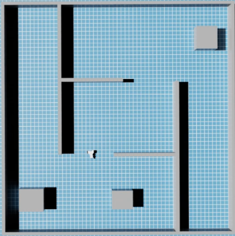

# Isaac Sim HEROS development fixture

## Purpose

Isaac Sim is the primary controlled development environment for the project.
The current fixture was upgraded from the original TurtleBot-oriented test scene
to an industrially more relevant Innok HEROS 3W platform with a SICK
microScan3-style RTX lidar.



This is still a **development fixture**, not yet the deterministic packaged
benchmark platform planned for later simulator-platform work.

## Current fixture contract

The validated live simulator publishes:

```text
/cmd_vel   subscription for differential drive
/clock     simulation time
/odom      simulated odometry
/tf        dynamic transforms
/tf_static static sensor transform
/scan      sensor_msgs/msg/LaserScan
```

The localization-relevant chain is:

```text
map -> odom -> base_link -> base_scan -> lidar_frame
```

AMCL publishes `map -> odom`. Isaac publishes robot odometry and the robot/sensor
chain. The current `base_scan -> lidar_frame` correction is identity because the
RTX sensor is oriented correctly in the validated HEROS stage.

## Source-backed robot values and fixture assumptions

The HEROS 3W fixture uses these source-backed drive values:

| Value | Setting |
|---|---:|
| wheel radius | 0.16 m |
| wheel separation | 0.58 m |
| maximum linear speed | 1.0 m/s |
| maximum angular speed | 2.0 rad/s |

The supplied Innok description does not provide the SICK scanner model or its
mounting transform. The current scanner mount is therefore explicitly a
**simulation fixture assumption**, validated visually and through scan/map
alignment rather than presented as manufacturer data.

The source fixture uses approximately:

```text
base_scan relative to base_link: x=0.95 m, y=0.0 m, z=0.10 m
base_scan -> lidar_frame: identity rotation
```

## Start Isaac Sim

From the DGX/Isaac host:

```bash
cd ~/Development/ros2_hybrid_localization
tools/isaac_sim/run.sh
```

The launcher bind-mounts the repository read-only inside the container at:

```text
/workspace/ros2_hybrid_localization
```

and exposes the package root through:

```text
HYBRID_LOCALIZATION_ISAAC_SIM_ROOT=/workspace/ros2_hybrid_localization/src/hybrid_localization_isaac_sim
```

This is required because Isaac's Script Editor can execute temporary copies of
scripts, making `__file__` unsuitable as the only package-root locator.

## Build/load the HEROS scene

The current manual workflow is:

1. Import `robot/heros_3w_isaac.urdf` or load the saved working HEROS stage.
2. Ensure the imported robot root is `/World/heros_3w`.
3. Ensure the articulation and drive joints are present.
4. Ensure one RTX `OmniLidar` exists beneath `base_scan`, currently under the
   SICK microScan3 hierarchy.
5. Run `scripts/build_heros_world.py` in the Isaac Script Editor when rebuilding
   the collision environment.
6. Run `scripts/heros_isaac_graph_helper.py` to create the ROS graphs.
7. Press Play.

The graph helper resolves the current imported hierarchy, discovers the
articulation root, validates the drive joints, finds the OmniLidar recursively,
and creates the drive/clock/odometry/TF/lidar graphs.

## Shared map/world layout

The deterministic test environment is based on:

```text
config/heros_world_layout.json
```

That shared source feeds both:

```text
scripts/generate_heros_map.py -> maps/heros_localization_map.png
scripts/build_heros_world.py  -> /World/HEROS_TestWorld
```

The map is 600 x 600 cells at 0.05 m/cell with origin `[-15, -15, 0]`, yielding a
30 m x 30 m occupancy grid.

A map-orientation mismatch was discovered during observation-mode validation because the
layout is sufficiently symmetric to make a coarse endpoint metric look
plausible even when the image orientation is wrong. The current generated map
and live Isaac world were visually checked after correcting both image axes.

## ROS environment outside the Isaac container

Use:

```bash
source /opt/ros/jazzy/setup.bash
source ~/.ros/isaac_fastdds_env.sh
unset ROS_LOCALHOST_ONLY
export ROS_AUTOMATIC_DISCOVERY_RANGE=SUBNET
source ~/Development/ros2_hybrid_localization/install/setup.bash
```

Do this for gamepad, map/AMCL/analysis, validators, and command-line inspection.

## Test simulator outputs

After pressing Play:

```bash
ros2 topic list | grep -E '^/(clock|scan|odom|tf|tf_static|cmd_vel)$'
ros2 topic hz /scan
ros2 topic hz /odom
ros2 run tf2_ros tf2_echo odom base_link
ros2 run tf2_ros tf2_echo base_link base_scan
ros2 run tf2_ros tf2_echo base_scan lidar_frame
```

During observation-mode validation `/scan` was observed around 46-49 Hz. Brief initial
`tf2_echo` "frame does not exist" messages may occur while DDS/TF discovery
completes; a transform that subsequently resolves is the meaningful result.

## Independent gamepad control

Keep teleoperation separate from localization so AMCL/analysis can be restarted
without resetting the simulated robot:

```bash
ros2 run hybrid_localization_isaac_sim start_gamepad.sh
```

The default helper uses `/dev/input/js0`, linear axis 1, angular axis 0, linear
scale 0.8, angular scale 1.2, and 20 Hz autorepeat. These may be overridden with
environment variables defined in the script.

## Start localization observation mode

```bash
ros2 run hybrid_localization_isaac_sim start_observation_mode.sh
```

This starts the map server, AMCL, particle analysis, and visualization while
leaving Isaac/gamepad independent.

The simulator AMCL profile starts with a deterministic pose for nominal fixture
validation:

```text
set_initial_pose: true
initial_pose: x=0, y=0, yaw=0
min_particles: 500
max_particles: 2500
random_seed: 41
```

Later global-localization scenarios should override this deterministic startup.

## Validate map/scan geometry

Before interpreting AMCL or GMM quality:

```bash
ros2 run hybrid_localization_isaac_sim validate_scan_map_alignment.py
```

For a stricter check:

```bash
ros2 run hybrid_localization_isaac_sim validate_scan_map_alignment.py --tolerance 0.05
```

Validated observation-mode results after correcting map orientation:

```text
0.10 m tolerance: 167 / 168 endpoints, hit fraction 0.994, PASS
0.05 m tolerance:  44 /  59 endpoints, hit fraction 0.746, PASS
0.01 m tolerance:  56 / 182 endpoints, hit fraction 0.308, FAIL
```

The 1 cm result should not be interpreted as a localization failure. It is below
occupancy-grid/raster/wall-surface accuracy. Conversely, the pass score at a
loose tolerance is not sufficient by itself because symmetric geometry can
produce optimistic matches. Always combine the metric with visual orientation
and scan-on-wall inspection in RViz.

## Remote RViz

The repository includes `tools/rviz/` for an x86/Linux visualization client.
The client uses host networking and a Fast DDS profile when available.

Build once:

```bash
tools/rviz/build.sh
```

Run:

```bash
tools/rviz/run.sh
```

The canonical config is mounted from:

```text
src/hybrid_localization_ros/rviz/particle_analysis.rviz
```

A standalone copy of `tools/rviz` plus the RViz config may also be used on a
client without cloning the full repository.
